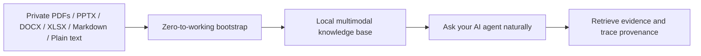

<div align="center">
  <h1>DocMason</h1>
  <p><strong>Turn private office documents into a local multimodal knowledge base your AI agent can actually use.</strong></p>
  <p>Local-first. Provenance-first. Built for serious white-collar work.</p>
  <p>
    
    
    
    
  </p>
</div>

DocMason is for people who need more than keyword search:

- ask natural business questions against private PDFs, decks, spreadsheets, docs, and repo-native text sources
- retrieve evidence bundles instead of vague summaries
- trace claims back to provenance
- keep the workflow local, file-first, and auditable

The current native and supported v1 path is Codex on macOS.
Other agent ecosystems matter, but they are treated as compatibility targets built on top of that primary workflow.

The current repository also supports a narrower but important extension beyond pure factual QA:
odd or non-typical document questions can stay KB-native when the published corpus already exposes
the needed text, render, structure, notes, or media evidence.

## Why This Exists

Most document pipelines flatten complex business material into weak text dumps.
That breaks down on the documents people actually care about:

- slide decks with screenshots and layout meaning
- spreadsheets where structure matters as much as text
- multilingual reports
- cross-referential proposals, plans, and reviews

DocMason is built around a different assumption:

- preserve multimodal evidence
- prepare deterministic file-based artifacts
- let strong AI agents do the hardest semantic work
- validate the resulting knowledge base with code
- keep everything local-file-first and repository-native

## What It Feels Like



The target experience is simple:

1. Put private files into `original_doc/`.
2. Run one bootstrap command.
3. Build the knowledge base.
4. Ask naturally inside your AI agent.

Ordinary users should not need to learn internal workflow IDs like `grounded-answer`, `retrieval-workflow`, or `validation-repair`.
Inside a valid workspace, natural freeform asking is the primary UX.

## Zero To Working

From a raw checkout on macOS:

```bash
./scripts/bootstrap-workspace.sh --yes
./.venv/bin/python -m docmason sync
```

Then continue inside your agent with natural requests such as:

- `What does the AI data readiness deck actually say about rollout risk?`
- `Which document supports this claim?`
- `Please review my recent degraded answer traces.`

If you want a machine-readable readiness snapshot after bootstrap:

```bash
./.venv/bin/python -m docmason doctor --json
```

The bootstrap launcher is designed for first-run setup:

- it can prepare `.venv` before the package is importable from the `src/` layout
- on the native macOS path, it can auto-install supported dependencies such as Python via Homebrew, uv, and LibreOffice when automation is available
- after bootstrap, ordinary repository commands should prefer the repo-local `.venv`

If you are using the generated Claude adapter surface, run `./.venv/bin/python -m docmason sync-adapters` when you need it.
That adapter step is important for that ecosystem, but it is not part of the default first-answer path for every user.

## What You Get Today

- Incremental knowledge-base build and refresh.
- Validation-gated publication into `knowledge_base/current/`.
- Deterministic retrieval and provenance trace over the published corpus.
- First-class Markdown, plain-text, and `.eml` knowledge sources plus lightweight-compatible text-like inputs.
- Implicit user-native source reference resolution for `ask` and `retrieve`, with auditable notices when references are only approximate or unresolved.
- The user-facing `ask` workflow for natural questions inside a valid workspace.
- Conversation-native logging, review summaries, and benchmark-candidate extraction.
- Pending interaction-derived overlay retrieval plus staged and published interaction memory support.
- KB-native odd-question support through published evidence channels rather than default source rerender.

A capable agent should also behave honestly on first contact:

- if no published knowledge base exists yet, it should guide the user toward setup or sync instead of bluffing an answer
- if the knowledge base is stale, it should say so
- if the user explicitly needs the latest local document state, it should offer sync before answering

## Why It Feels Different

- Multimodal by design: evidence is prepared for both text and rendered-image inspection when the document demands it.
- Agent-native: the main operating model is working with a strong AI agent inside the repository, not sending files into a bespoke backend product.
- File-only knowledge base: no required database service, no hidden SaaS dependency, no platform lock-in.
- Provenance-first: retrieval and trace are first-class, not an afterthought.
- Honest boundaries: if the environment cannot support a required workflow, the system should fail clearly instead of producing weak pretend output.
- Small stable CLI, richer workflow layer: deterministic machine operations stay compact while the agent-facing workflow layer handles composition and routing.

## Public Surface Today

The stable public command surface now includes nine commands:

- `docmason prepare`
- `docmason doctor`
- `docmason status`
- `docmason sync`
- `docmason retrieve`
- `docmason trace`
- `docmason validate-kb`
- `docmason sync-adapters`
- `docmason workflow`

The public CLI keeps a deterministic substrate and can expand when that materially improves usability, auditability, and operator reliability.
`docmason workflow` is the advanced public execution surface for explicit workflow-level operator and agent use.
The primary user-facing natural-language workflow is `ask`, not a new public CLI command.

In practice, the surface is layered like this:

- ordinary business questions: `ask`
- explicit setup or repair: `doctor`, `prepare`, `status`
- explicit build or refresh: `sync`
- explicit evidence lookup: `retrieve`
- explicit provenance proof: `trace`
- explicit adapter maintenance: `sync-adapters`
- advanced explicit workflow execution: `workflow`

Advanced contributors and operator tooling also rely on a broader canonical workflow layer inside `skills/canonical/`, but ordinary users should not need to name those internal workflows to get work done.

`docmason retrieve` now parses user-native source references implicitly from the freeform query and always returns a structured `reference_resolution` block in `--json` output.
The normal CLI echoes the resolution status and any best-effort notice.
`docmason trace` intentionally remains ID-first in this phase and still expects `--source-id`, `--unit-id`, `--answer-file`, or `--session-id` rather than a new freeform source-reference surface.

## Native Reference Workflow

DocMason should feel most natural in this environment:

- AI agent: Codex
- platform: macOS
- language runtime: Python 3.11 or newer
- package workflow: `uv` first, `pip` fallback

This is the current supported v1 platform target.
Other platforms may become support targets later, but they should not be treated as equally supported today.

## Supported Inputs

Current v1 input support is tiered:

- Office/PDF first-class: `pdf`, `pptx`, `ppt`, `docx`, `doc`, `xlsx`, `xls`
- Text first-class: `md`, `markdown`, `txt`
- Email first-class: `eml`
- Text lightweight-compatible: `mdx`, `yaml`, `yml`, `tex`, `csv`, `tsv`

For PowerPoint, Word, and Excel inputs, high-fidelity rendering depends on LibreOffice. Legacy `.ppt`, `.doc`, and `.xls` files are normalized through LibreOffice into the same published office-source pipeline used for `.pptx`, `.docx`, and `.xlsx`.
Markdown, plain text, `.eml`, and the lightweight-compatible text family do not require LibreOffice.

## Office Rendering Setup

If your corpus includes PowerPoint, Word, or Excel files such as `.pptx`, `.ppt`, `.docx`, `.doc`, `.xlsx`, or `.xls`, DocMason requires LibreOffice for high-fidelity rendering.

Recommended setup:

- macOS with Homebrew already installed: let `./scripts/bootstrap-workspace.sh --yes` or `docmason prepare --yes` install it automatically when the current corpus needs it, or run `brew install --cask libreoffice`
- macOS without Homebrew: download the official macOS installer from `https://www.libreoffice.org/download/download/`, open the `.dmg`, and drag LibreOffice into `/Applications`

Verification:

- run `./.venv/bin/python -m docmason doctor`
- on standard macOS installs, DocMason detects `/Applications/LibreOffice.app/Contents/MacOS/soffice` automatically

## Privacy And Local-First Boundary

DocMason is designed to work locally over private files.

The repository itself should not send content to external cloud APIs by default.
Users may still choose to operate the project through external AI agents, and those agents may have their own privacy and retention behavior.
Choosing an agent that matches the user's privacy requirements remains the user's responsibility.

Do not commit private source documents, compiled knowledge bases, or runtime state to the public repository.

## Current Status

Project status as of March 21, 2026:

Historical implemented phases:

- Phase 1, Repository Foundation and Public Face
- Phase 2, Agent Operating Surface and Workspace Bootstrap
- Phase 3, Knowledge-Base Construction and Validation
- Phase 4, Incremental Maintenance, Retrieval, and Trace
- Phase 4b, Workflow Productization and Execution Orchestration
- Phase 5, Benchmarking, Evaluation, and Feedback Foundation
- Phase 6, Natural Intent Routing and Conversation-Native Logging
- Phase 6 follow-on, Native Chat Reconciliation and Interaction-Derived Knowledge Overlay
- Phase 6b1, Pre-Learning Boundary, Answer Contract, and Regression Closure
- Phase 6b2, User-Native Source Reference Resolution
- Phase 6b3, Markdown and Plain-Text First-Class Knowledge Sources

Current architecture refactor program:

- Phase 0, Rename To DocMason: implemented
- Phase 1, Run Control, Turn Ownership, and Commit Barrier: implemented
- Phase 2, Workspace Coordination, Atomic Publish, and Projection Discipline: implemented
- Phase 3, Spreadsheet and Multimodal Evidence Compiler Deepening: planned
- Phase 4, Governed Interaction Memory and Operator Control Plane: planned

What is intentionally not implemented yet:

- watch mode

This README is intentionally promotional in tone, but it does not claim later-phase functionality that the repository does not yet ship.

## Repository Layout

The repository keeps private corpus data and generated artifacts local:

```text
DocMason/
├── README.md
├── AGENTS.md
├── LICENSE
├── CONTRIBUTING.md
├── SECURITY.md
├── docmason.yaml
├── pyproject.toml
├── src/
│   └── docmason/
├── tests/
├── docs/
├── scripts/
├── skills/
│   └── canonical/
├── adapters/        # local/generated, gitignored
├── original_doc/    # private source corpus, gitignored
├── knowledge_base/  # private/generated, gitignored
└── runtime/         # private/generated, gitignored
```

## For Contributors

- `AGENTS.md` is the minimal first-contact contract for agents inside the workspace.
- `skills/canonical/` contains the detailed canonical workflow contracts that agents should follow after first contact.
- `docs/` contains deeper public notes on product direction, workflows, orchestration, and policies.
- `scripts/bootstrap-workspace.sh` is the preferred zero-to-working launcher from a raw checkout.

## If This Direction Matters

If this is the kind of document-native, provenance-first AI workflow you want to use or help shape:

- try the bootstrap flow on a real private corpus
- file issues when the setup or answer path feels rough
- star the repository if you want to follow the project as it hardens
