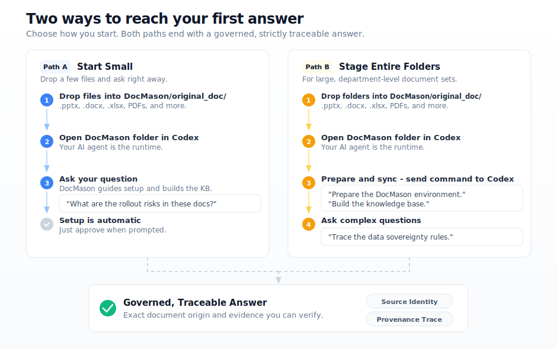

  <h1>DocMason</h1>
  
<strong>A repo-native agent app for deep research over private work files.</strong>

  
The repo is the app. Codex is the runtime.

  
Build a local, evidence-first knowledge base with provenance.

  

    <a href="https://github.com/JetXu-LLM/DocMason/releases/latest/download/DocMason-clean.zip"><strong>Download DocMason</strong></a>
  

  
Already paying for OpenAI? <a href="https://openai.com/codex"><strong>Codex for macOS</strong></a> is included in your plan. Open DocMason inside Codex — and finally put your AI to work on your real private documents, not just chat prompts. Zero-to-working in minutes. <b>Unlock the full power of your subscription.</b>

  

    
    
    
    
  

Most workspace AI tools flatten your complex office documents into a single unstructured blob. They can summarize a file or retrieve a quote, but once the question gets hard, it becomes difficult to verify how the answer maps back to the source.

**DocMason** is built around a different thesis: **answers must be traceable**. It creates a local, file-based knowledge base over your private decks, spreadsheets, documents, PDFs, screenshots, and notes, so your AI agent can reason over multimodal evidence instead of a flattened text blob. It is not lightweight doc chat over anonymous chunks; it retrieves real evidence bundles with strict source provenance. A local repo, running as a deep-research AI app on Codex — no hidden backends, no cloud ingestion. Just local files and answers you can actually verify.

## Start Here

- **[Download DocMason](https://github.com/JetXu-LLM/DocMason/releases/latest/download/DocMason-clean.zip)**: The ready-to-use workspace — everything you need to start with your private files. No `.git`, no test suites, just empty workspace directories.
- **[Try the Public Demo Bundle](https://github.com/JetXu-LLM/DocMason/releases/latest/download/DocMason-demo-ico-gcs.zip)**: The fastest public proof path if you want to see a rigorously traceable answer before using your own files.

*Native path is Codex on macOS. Claude Code is also well supported.*

## Public Proof Case

The fastest public proof today uses the ICO + GCS demo corpus compiled from official UK public-sector releases.

**Ask this through your AI agent:**
> "Across the ICO and GCS materials, what are the main rollout risks, and which sources support them?"

**What good looks like:**
- **Cross-Document Reasoning:** The answer synthesizes overlapping governance risks instead of echoing documents one by one.
- The answer explicitly points to the exact document origin, instead of blurring the corpus into one anonymous narrative.
- **The answer is inherently traceable** — providing the real evidence bundles so you can verify the root context.

[Try the ICO + GCS Demo Bundle](https://github.com/JetXu-LLM/DocMason/releases/latest/download/DocMason-demo-ico-gcs.zip) to test a governed truth environment before transitioning to your own private folders.

## Why It Feels Safer

DocMason is built for **deep research** over your real work files — where every answer must be **traceable** to its actual source.

* **Strict Source Identity.** DocMason enforces strict document boundaries. It prevents agents from hallucinating cross-source facts that only vaguely fit together.
* **Answers Are Traceable.** You don't just get convincing text. You get a verifiable lineage pointing directly to the exact file and page you dropped in.
* **100% Local and Auditable.** Your files, staged data, and compiled knowledge base remain physically inside your local folder boundary. [See more →](#privacy-and-local-first-boundary)

## Two Easy Ways to Start

- **Path A: Start Small**
  Drop a handful of work files (`.pptx`, `.docx`, `.xlsx`, PDFs) into the `DocMason/original_doc/` folder. Open the DocMason folder in Codex, and ask your question naturally. DocMason intelligently guides you through environment setup and quietly builds the knowledge base in the background — just approve when prompted. After that, you can keep adding or revising files inside `original_doc/`; on the native path, DocMason can quietly and incrementally sync the published knowledge base instead of forcing a full restart.

- **Path B: Stage Entire Folders**
  Drop your massive, department-level folders into `DocMason/original_doc/`. Open the DocMason folder in Codex. Tell Codex:
  > "Please prepare the DocMason environment."

  Then:
  > "Please build the knowledge base."

  Once it's done, start asking complex research questions against the entire published corpus.

*Inside a valid workspace, you do not need to memorize internal commands. Just speak naturally to your AI agent.*

**What gets installed:** DocMason needs **[LibreOffice](https://www.libreoffice.org/)** to parse Office files (`.pptx`, `.docx`, `.xlsx`) with full fidelity — this is the most important external dependency. It also sets up a local Python environment automatically. If you don't have [Homebrew](https://brew.sh/) installed, DocMason will guide you through that too. All setup is handled through your AI agent — just approve installations when prompted.

## Supported Work File Types

- **First-Class Office & PDF**: `pdf`, `pptx`, `ppt`, `docx`, `doc`, `xlsx`, `xls`
- **First-Class Deep Text**: `md`, `markdown`, `txt`, `eml` (email)
- **Lightweight Text**: `mdx`, `yaml`, `yml`, `tex`, `csv`, `tsv`

High-fidelity Office file parsing relies on a lightweight local LibreOffice shim. PDF parsing uses the embedded stack (`PyMuPDF`, `pypdfium2`, `pypdf`, `pillow`). Together they preserve multimodal structure, layout, and sheet/page context for deeper analysis, not just plain-text extraction. Markdown, plain text, `.eml`, and the lightweight-compatible family do not require LibreOffice.

## Why This Exists

Most document AI tools map complex corporate files into flat, unreadable text strings. They strip out critical structural and formatting semantics:

- **Slide Decks**: Visual layout, presenter notes, and chart-text relationships are discarded.
- **Spreadsheets**: Multi-sheet references and nested tables break existing parsers.
- **Format-as-Semantics**: Critical signals (like red text for "Risk" or indentation for hierarchies) are erased.
- **Cross-Document Reasoning**: Multi-part proposals are disconnected, making global synthesis impossible.

DocMason addresses this by forcing AI to respect original document structure and visual semantics. It produces deterministic file-based evidence, runs strong offline retrieval and trace algorithms, and validates the resulting knowledge base through strict code rules — all locally, with nothing leaving your machine. The repo holds the truth. The agent does the reasoning.

## Getting Started on macOS

**Five steps from download to your first traceable answer — no developer experience required.**

**1. Download, unzip, and drop in your files**

[Download DocMason](https://github.com/JetXu-LLM/DocMason/releases/latest/download/DocMason-clean.zip), unzip it to any folder on your Mac, then drag your `.pptx`, `.docx`, `.xlsx`, `.pdf`, and other work files into `DocMason/original_doc/`.

**2. Open the DocMason folder in Codex**

Launch [Codex for macOS](https://openai.com/codex) (or Claude Code) and open the DocMason folder as your workspace. This is the operating model — the repo is your app, the agent is your runtime.

**3. Ask your agent to prepare the environment**

> "Please prepare the DocMason environment."

**DocMason will set up a managed local Python environment, install required dependencies, and guide you through LibreOffice installation via Homebrew if it's not already present. Just approve when prompted. If Homebrew itself is missing, DocMason will guide that installation too.**

**4. Build the knowledge base** *(for medium-to-large corpora)*

> "Please build the knowledge base."

DocMason stages, compiles, validates, and publishes your documents into a searchable evidence layer. For a small handful of files, DocMason may handle this step automatically during your first question.

**5. Start asking questions**

> "What are the main rollout risks across these documents, and which sources support them?"

Your answers come with exact source identity and provenance trace — you can verify every claim against the original file and page.

## What You Get Today

- **Incremental Sync**: Add or revise files in `original_doc/`, and DocMason can quietly rebuild and republish your local `knowledge_base/current/` without forcing a full reset.
- **Validation-Gated Commits**: Bad data fails the build instead of quietly degrading answers.
- **Rich Source Parsing**: First-class handling for `.pdf`, `.pptx`, `.xlsx`, `.md`, `.eml`, and more.
- **Deterministic Retrieval**: Exact provenance trace over published corpora.
- **Review Surface**: Conversation-native logging and extraction for real analysis.

## Privacy and Local-First Boundary

DocMason is designed to run entirely over local files. Here's exactly what that means:

**DocMason does NOT send any of the following over the network:**
- Your document content, file names, or file paths
- Your queries or answer text
- Any corpus data, evidence bundles, or knowledge-base artifacts

**All AI inference traffic** is handled by your chosen host agent (Codex, Claude Code, etc.) — DocMason itself makes zero model API calls. The network behavior of your AI agent is governed by that agent's own privacy and telemetry policy.

**The only network request DocMason may make:**
Generated `clean` and `demo-ico-gcs` release bundles may only perform a bounded update check: automatically after canonical `ask` completion, or when you explicitly run `docmason update-core`. This path is disabled in the source repository, the automatic check respects `DO_NOT_TRACK=1`, and it never sends corpus content, file names, file paths, query text, answer text, source locators, environment variables, secrets, machine fingerprints, or IP-derived identifiers. See [Release Entry And Networking](docs/policies/release-entry-and-networking.md).

**Your responsibility:**
- Configure your host agent's telemetry and privacy settings according to your own standards.
- Do NOT commit `original_doc/`, `knowledge_base/`, or `runtime/` directories to any public repository.

## Current Status

DocMason is **alpha**, and already ships the functional core of the local workflow:
- Workspace repair and rapid bootstrapping
- Knowledge-base structural sync and incremental refresh
- Deterministic retrieval and provenance trace boundaries
- Natural-language `ask` with conversation-native logging

**Host compatibility:**
- **Native**: Codex on macOS (reference experience)
- **Well supported**: Claude Code
- **Also works**: GitHub Copilot (VS Code)

**Recommended model**: We strongly recommend running DocMason with **GPT 5.4** or models of equivalent reasoning depth. Weaker models may produce degraded answers and unreliable trace boundaries.

**Environment**: Managed repo-local Python `3.13` on macOS.

*Watch mode and automatic sync are intentionally out-of-scope for the present build.*

## Deeper Documentation

- [Product Rationale](docs/product/README.md)
- [Distribution and Bundles](docs/product/distribution-and-benchmarks.md)
- [Workflow Layers](docs/workflows/README.md)
- [Execution Orchestration](docs/workflows/execution-orchestration.md)
- [Architecture Index](docs/architecture/README.md)

---

## Our Vision

DocMason is building toward a future where every professional has access to a **deep, intelligent, and privacy-first AI assistant** over their work documents — one where provenance and traceability are first-class requirements, not afterthoughts.

We believe AI document analysis should be:
- **Honest**: answers tied to verifiable evidence, not plausible-sounding fiction.
- **Private**: your files stay on your machine, under your control.
- **Open**: the full logic is inspectable, auditable, and improvable.

**If this direction resonates with how you actually work:**
- **[Star this repository](https://github.com/JetXu-LLM/DocMason)** to follow the project as it matures.
- Try the clean bundle on your real work files.
- [File an issue](https://github.com/JetXu-LLM/DocMason/issues) when the answer quality or trace boundary breaks down.
- Share with colleagues who are tired of AI answers they can't verify.

*The repo is the app. Codex is the runtime. Your documents deserve both.*
