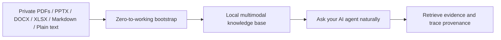

<div align="center">
  <h1>DocMason</h1>
  <p><strong>The repo is the app. Codex is the runtime.</strong></p>
  <p>Turn private work files into a local, evidence-first knowledge base for AI-assisted deep research.</p>
  <p>
    
    
    
    
  </p>
</div>

DocMason is for people who need more than keyword search:

- ask natural business questions against private PDFs, decks, spreadsheets, docs, and repo-native text sources
- retrieve evidence bundles instead of vague summaries
- trace claims back to provenance
- keep the workflow local, file-first, and auditable

The current native reference workflow is Codex on macOS.
Claude Code and GitHub Copilot also receive quiet repository-native compatibility adaptations, so users can open the same repo, follow the same bootstrap and sync path, and start working without a separate adapter ritual.

The current repository also supports a narrower but important extension beyond pure factual QA:
odd or non-typical document questions can stay KB-native when the published corpus already exposes
the needed text, render, structure, notes, or media evidence.

## Choose Your Start

Pick the entry point that matches what you want to do on minute one:

- [Use Privately](../../releases/latest/download/DocMason-clean.zip): download the clean workspace bundle with no `.git`, no `tests/`, and empty live workspace directories.
- [Try ICO + GCS Demo](../../releases/latest/download/DocMason-demo-ico-gcs.zip): download the demo workspace bundle with no `.git`, no `tests/`, and a preloaded public sample corpus in `original_doc/`.
- [Develop / Contribute](CONTRIBUTING.md): clone the canonical source repo, keep `tests/` and the tracked public demo corpus, then materialize the demo corpus locally only when you want it.

The clean and demo bundles also include the committed GitHub Copilot workspace instructions so bundle users get the same AGENTS-first repository guidance without extra setup.

## Why This Exists

Most document pipelines flatten complex business material into weak text dumps.
That breaks down on the documents people actually care about:

- slide decks with screenshots and layout meaning
- spreadsheets where structure matters as much as text
- multilingual reports
- cross-referential proposals, plans, and reviews

DocMason is built around a different assumption:

- preserve multimodal evidence
- prepare deterministic file-based artifacts
- add richer semantic overlays when a capable multimodal agent is available
- let strong AI agents do the hardest semantic work
- validate the resulting knowledge base with code
- keep everything local-file-first and repository-native

## What It Feels Like



The target experience is simple:

1. Put private files into `original_doc/`, or materialize the public sample corpus if you are evaluating the project.
2. Run one bootstrap command.
3. Build the knowledge base.
4. Ask naturally inside your AI agent.

Ordinary users should not need to learn internal workflow IDs like `grounded-answer`, `retrieval-workflow`, or `validation-repair`.
Inside a valid workspace, natural freeform asking is the primary UX.

## Zero To Working

The project now has three intentional entry modes:

- private real use: download the clean release bundle, then put your own files into `original_doc/`
- public product evaluation: download the demo release bundle with `ICO + GCS` already materialized in `original_doc/`
- source-repo development: clone the canonical repo, then ask your agent to use `public-sample-workspace`, or run `python3 scripts/use-sample-corpus.py --preset ico-gcs` if you want the public demo corpus in your local workspace

From a raw checkout or release bundle on macOS:

```bash
./scripts/bootstrap-workspace.sh --yes
./.venv/bin/python -m docmason sync
```

Then continue inside your agent with natural requests such as:

- `What does the AI data readiness deck actually say about rollout risk?`
- `Which document supports this claim?`
- `Please review my recent degraded answer traces.`

If you want a machine-readable readiness snapshot after bootstrap:

```bash
./.venv/bin/python -m docmason doctor --json
```

The bootstrap launcher is designed for first-run setup:

- it can start from a raw checkout by delegating to `docmason prepare --yes` through a bootstrap Python before the package is installed
- on the native macOS path, it can auto-install Homebrew and a supported shared bootstrap Python when no usable bootstrap interpreter is already available
- `prepare` then provisions repo-local managed Python `3.13` under `.docmason/toolchain/python/` and rebuilds `.venv` against that runtime
- when `uv` is unavailable, `prepare` provisions a repo-local bootstrap helper venv under `.docmason/toolchain/bootstrap/venv` instead of falling back to an externally anchored steady-state `.venv`
- it refreshes repo-local skill shims under `.agents/skills` and `.claude/skills` instead of touching a global Codex skills directory
- after bootstrap, ordinary repository commands should prefer the repo-local `.venv`

If your shell, platform, or agent environment cannot run the normal launcher path cleanly, use the
deeper fallback guide in [`docs/setup/manual-workspace-recovery.md`](docs/setup/manual-workspace-recovery.md).

If you are using the generated Claude adapter surface, run `./.venv/bin/python -m docmason sync-adapters` when you need it.
That adapter step is important for that ecosystem, but it is not part of the default first-answer path for every user.

## Distribution Model

DocMason intentionally separates the canonical source repository from the end-user release bundles.

- The canonical `main` branch is the contributor surface.
  It keeps `tests/`, the tracked public demo corpus under `sample_corpus/`, and the scripts that
  build clean/demo release bundles.
- The clean release bundle is the safest private-workspace start.
- The demo release bundle is the fastest product-evaluation start.

This boundary is deliberate:

- live `original_doc/` is the writable user-managed corpus boundary
- `sample_corpus/` is the tracked public fixture boundary used to build demo experiences and contributor regressions

The deeper rationale lives in [`docs/product/distribution-and-benchmarks.md`](docs/product/distribution-and-benchmarks.md).

## What You Get Today

- Incremental knowledge-base build and refresh.
- Validation-gated publication into `knowledge_base/current/`.
- Deterministic retrieval and provenance trace over the published corpus.
- First-class Markdown, plain-text, and `.eml` knowledge sources plus lightweight-compatible text-like inputs.
- Implicit user-native source reference resolution for `ask` and `retrieve`, with auditable notices when references are only approximate or unresolved.
- The user-facing `ask` workflow for natural questions inside a valid workspace.
- Conversation-native logging, review summaries, and benchmark-candidate extraction.
- Pending interaction-derived overlay retrieval plus staged and published interaction memory support.
- KB-native odd-question support through published evidence channels rather than default source rerender.
- Deterministic PDF document-context sidecars plus first-class `page-image` artifacts for image-heavy or scanned pages.
- Additive workflow-level hybrid enrichment through `knowledge_base/staging/hybrid_work.json` when a capable multimodal host agent is available.

A capable agent should also behave honestly on first contact:

- if a workspace-dependent first ask arrives before the environment is ready, it should silently
  attempt workspace bootstrap or repair before asking the user for manual help
- once `runtime/bootstrap_state.json` says the current root is ready, repeated asks should reuse
  that cached readiness marker instead of rerunning deep setup checks every time
- if no published knowledge base exists yet, it should guide the user toward setup or sync instead of bluffing an answer
- if the knowledge base is stale, it should say so
- if the user explicitly needs the latest local document state, it should offer sync before answering

## Why It Feels Different

- Multimodal by design: evidence is prepared for both text and rendered-image inspection when the document demands it.
- Hard-artifact first: the shipped deterministic compiler builds page, slide, sheet, and artifact targets first, then the workflow-level multimodal lane only enriches the hard artifacts that still need semantic closure.
- Agent-native: the main operating model is working with a strong AI agent inside the repository, not sending files into a bespoke backend product.
- File-only knowledge base: no required database service, no hidden SaaS dependency, no platform lock-in.
- Provenance-first: retrieval and trace are first-class, not an afterthought.
- Honest boundaries: if the environment cannot support a required workflow, the system should fail clearly instead of producing weak pretend output.
- Small stable CLI, richer workflow layer: deterministic machine operations stay compact while the agent-facing workflow layer handles composition and routing.

## Public Surface Today

The stable public command surface now includes nine commands:

- `docmason prepare`
- `docmason doctor`
- `docmason status`
- `docmason sync`
- `docmason retrieve`
- `docmason trace`
- `docmason validate-kb`
- `docmason sync-adapters`
- `docmason workflow`

The public CLI keeps a deterministic substrate and can expand when that materially improves usability, auditability, and operator reliability.
`docmason workflow` is the advanced public execution surface for explicit workflow-level operator and agent use.
The primary user-facing natural-language workflow is `ask`, not a new public CLI command.
For multimodal closure, keep the boundary explicit: bare `docmason sync` publishes deterministic truth, while the canonical workflow layer may consume `hybrid_work.json` and add honest `semantic_overlay/` sidecars when the host agent can inspect renders.

In practice, the surface is layered like this:

- ordinary business questions: `ask`
- explicit setup or repair: `doctor`, `prepare`, `status`
- explicit build or refresh: `sync`
- explicit evidence lookup: `retrieve`
- explicit provenance proof: `trace`
- explicit adapter maintenance: `sync-adapters`
- advanced explicit workflow execution: `workflow`

Advanced contributors and operator tooling also rely on a broader canonical workflow layer inside `skills/canonical/`, but ordinary users should not need to name those internal workflows to get work done.

`docmason retrieve` now parses user-native source references implicitly from the freeform query and always returns a structured `reference_resolution` block in `--json` output.
The normal CLI echoes the resolution status and any best-effort notice.
`docmason trace` intentionally remains ID-first in this phase and still expects `--source-id`, `--unit-id`, `--answer-file`, or `--session-id` rather than a new freeform source-reference surface.

## Native Reference Workflow

DocMason should feel most natural in this environment:

- AI agent: Codex
- platform: macOS
- prepared-workspace runtime: repo-local managed Python `3.13`
- bootstrap or repair helper runtime: Python `3.11+`
- package workflow: repo-local `uv` during prepare, then repo-local `.venv` for ordinary commands

This is the current supported v1 platform target.
Other platforms may become support targets later, but they should not be treated as equally supported today.

## Supported Inputs

Current v1 input support is tiered:

- Office/PDF first-class: `pdf`, `pptx`, `ppt`, `docx`, `doc`, `xlsx`, `xls`
- Text first-class: `md`, `markdown`, `txt`
- Email first-class: `eml`
- Text lightweight-compatible: `mdx`, `yaml`, `yml`, `tex`, `csv`, `tsv`

For PowerPoint, Word, and Excel inputs, high-fidelity rendering depends on LibreOffice. Legacy `.ppt`, `.doc`, and `.xls` files are normalized through LibreOffice into the same published office-source pipeline used for `.pptx`, `.docx`, and `.xlsx`.
PDF-first corpora also rely on the repo-local PDF stack: `PyMuPDF` for deterministic region extraction, `pypdfium2` for renders, `pypdf` for conservative page handling, and `pillow` for image output.
Markdown, plain text, `.eml`, and the lightweight-compatible text family do not require LibreOffice.

## Office Rendering Setup

If your corpus includes PowerPoint, Word, or Excel files such as `.pptx`, `.ppt`, `.docx`, `.doc`, `.xlsx`, or `.xls`, DocMason requires LibreOffice for high-fidelity rendering.

Recommended setup:

- macOS with Homebrew already installed: let `./scripts/bootstrap-workspace.sh --yes` or `docmason prepare --yes` install it automatically when the current corpus needs it, or run `brew install --cask libreoffice-still`
- macOS without Homebrew: download the official macOS installer from `https://www.libreoffice.org/download/download/`, open the `.dmg`, and drag LibreOffice into `/Applications`

Verification:

- run `./.venv/bin/python -m docmason doctor`
- on standard macOS installs, DocMason detects `/Applications/LibreOffice.app/Contents/MacOS/soffice` automatically

If your corpus includes PDFs, keep the repo-local PDF stack installed as well. The normal editable install path already includes `PyMuPDF`, `pypdfium2`, `pypdf`, and `pillow`.
If you need the manual recovery path, follow [`docs/setup/manual-workspace-recovery.md`](docs/setup/manual-workspace-recovery.md).

## Privacy And Local-First Boundary

DocMason is designed to work locally over private files.

The repository itself should not send content to external cloud APIs by default.
Users may still choose to operate the project through external AI agents, and those agents may have their own privacy and retention behavior.
Choosing an agent that matches the user's privacy requirements remains the user's responsibility.

Do not commit private source documents, compiled knowledge bases, or runtime state to the public repository.
Tracked public sample fixtures belong under `sample_corpus/`, not under live `original_doc/`.

## Current Status

Project status as of March 21, 2026:

Historical implemented phases:

- Phase 1, Repository Foundation and Public Face
- Phase 2, Agent Operating Surface and Workspace Bootstrap
- Phase 3, Knowledge-Base Construction and Validation
- Phase 4, Incremental Maintenance, Retrieval, and Trace
- Phase 4b, Workflow Productization and Execution Orchestration
- Phase 5, Benchmarking, Evaluation, and Feedback Foundation
- Phase 6, Natural Intent Routing and Conversation-Native Logging
- Phase 6 follow-on, Native Chat Reconciliation and Interaction-Derived Knowledge Overlay
- Phase 6b1, Pre-Learning Boundary, Answer Contract, and Regression Closure
- Phase 6b2, User-Native Source Reference Resolution
- Phase 6b3, Markdown and Plain-Text First-Class Knowledge Sources

Current architecture refactor program:

- Phase 0, Rename To DocMason: implemented
- Phase 1, Run Control, Turn Ownership, and Commit Barrier: implemented
- Phase 2, Workspace Coordination, Atomic Publish, and Projection Discipline: implemented
- Phase 3, Spreadsheet and Multimodal Evidence Compiler Deepening: implemented, including `pdf_document.json`, richer native Office semantics, `page-image` artifacts for image-dominant PDF pages, and additive `semantic_overlay/` support through the workflow-level hybrid lane
- Phase 4, Governed Interaction Memory and Operator Control Plane: planned

What is intentionally not implemented yet:

- watch mode

This README is intentionally promotional in tone, but it does not claim later-phase functionality that the repository does not yet ship.

## Repository Layout

The canonical source repository keeps live workspace data local while still tracking the public demo
corpus:

```text
DocMason/
├── README.md
├── AGENTS.md
├── LICENSE
├── CONTRIBUTING.md
├── SECURITY.md
├── docmason.yaml
├── pyproject.toml
├── src/
│   └── docmason/
├── tests/
├── docs/
├── sample_corpus/   # tracked public demo fixtures
├── scripts/
├── skills/
│   └── canonical/
├── adapters/        # local/generated, gitignored
├── original_doc/    # live user corpus boundary, gitignored
├── knowledge_base/  # private/generated, gitignored
└── runtime/         # private/generated, gitignored
```

## For Contributors

- `AGENTS.md` is the minimal first-contact contract for agents inside the workspace.
- `skills/canonical/` contains the detailed canonical workflow contracts that agents should follow after first contact.
- `docs/` contains deeper public notes on product direction, workflows, orchestration, and policies.
- `scripts/bootstrap-workspace.sh` is the preferred zero-to-working launcher from a raw checkout.
- `public-sample-workspace` is the contributor-only optional skill for materializing the tracked public demo corpus into live `original_doc/`.
- `python3 scripts/use-sample-corpus.py --preset ico-gcs` remains the direct script path when you want the same setup without going through an agent skill.
- `sample_corpus/` is the tracked fixture boundary. Do not replace it with your private corpus.
- `scripts/install-git-hooks.sh` installs the repo safety hooks that block staged live workspace data and re-check tracked live workspace paths before push.

## If This Direction Matters

If this is the kind of document-native, provenance-first AI workflow you want to use or help shape:

- try the bootstrap flow on a real private corpus
- file issues when the setup or answer path feels rough
- star the repository if you want to follow the project as it hardens
